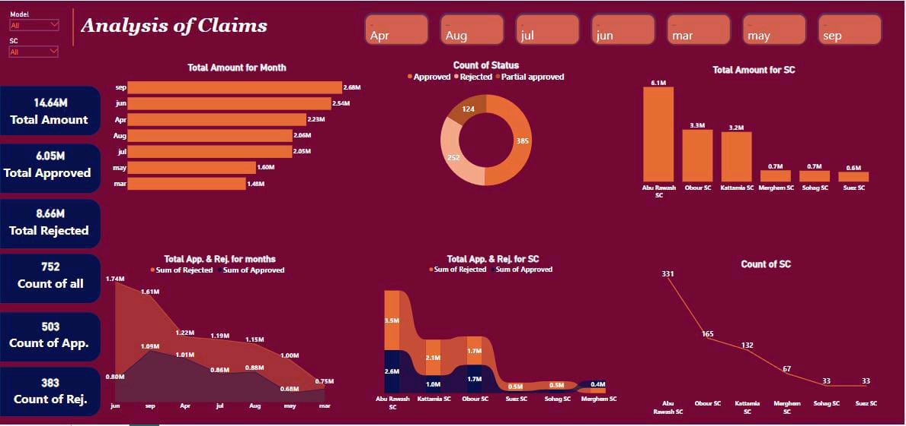

# Power BI Warranty Claims Analysis

## 🎥 Project Demo
[Watch the demo video](Claims.mp4)

## Project Overview
This Power BI project analyzes warranty claims from March to September 2024.  
The dashboard tracks claim status (approved, rejected, partial), financial impact, and service center performance.  

## Key Insights
- Improved efficiency in handling claims.  
- Highlighted trends in vehicle warranty management.  
- Identified top-performing service centers and areas for improvement.  

## Features
- ✅ Interactive dashboard with slicers and filters  
- ✅ Track claims by status: approved, rejected, partial  
- ✅ Analyze financial impact of claims  
- ✅ Compare performance across service centers  
- ✅ Visualize trends over time (Mar–Sep 2024)  
- ✅ Export charts and reports for presentations  
---

✨ *This repository showcases a practical application of data analysis in automotive warranty claims management.*
